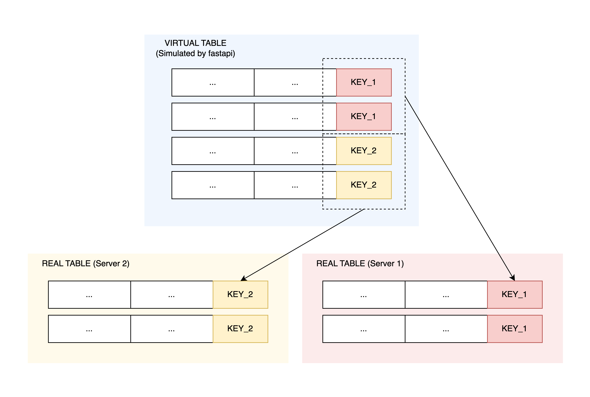

# MySQL Sharding Demo

This project demonstrates a sharded MySQL database architecture with a FastAPI backend and Python client. It shows how to implement database sharding - a technique that distributes data across multiple database instances to improve scalability and performance.

## Illustration



### Overview

This project implements a simple user management service that demonstrates horizontal database sharding. It includes:
- A FastAPI server that routes requests to the appropriate database shard
- Multiple MySQL database instances, each containing a subset of user data
- A sharding algorithm based on username
- Automatic shard selection based on request parameters
- A test client to demonstrate and verify sharding functionality

### Architecture

The system uses a hash-based sharding approach:

- User data is distributed across multiple database shards based on a hash of the username
- The server automatically routes requests to the appropriate shard
- Clients do not need to know which shard contains their data

### Components

#### Server

The server component is a FastAPI application that:

- Exposes REST API endpoints for user management
- Implements the sharding logic
- Connects to the appropriate database shard based on the username
- Provides logging with shard information

#### Client

The client component is a Python script that:

- Creates test users with random usernames
- Retrieves users by username
- Runs a demo to validate the sharding functionality

### Requirements

- Python 3.13+
- Docker and Docker Compose

### Running the Project

1. Clone the repository:
```
git clone https://github.com/Mohnish226/mysql-sharding-demo
cd mysql-sharding-demo
```

2. Start the MySQL database instances using Docker Compose:
```
docker-compose up -d
```

3. Run the test client:
```
cd client
python client.py
# If you want more users, you can run the following command
python client.py --users 100 --verbose
```

4. if you want to see the sharding load distribution, you can run the following command
```
cd server
python sharding.py --users 100 --shards 10
```